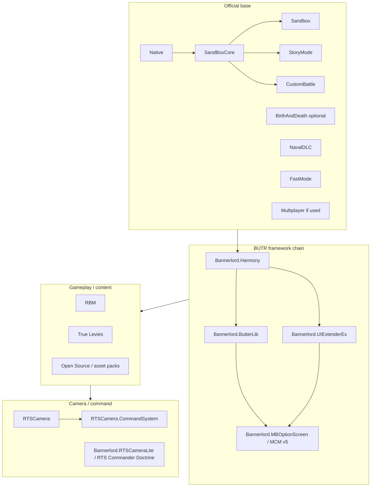

# Local Bannerlord load order and dependency audit

**Scope:** Installed modules under `GameRoot\Modules` and `Steam\steamapps\workshop\content\261550`, parsed from each root `SubModule.xml`.  
**Reference stack:** **Bannerlord.Harmony** (BUTR) as the Harmony entry point; **ButterLib**, **UIExtenderEx**, **Bannerlord.MBOptionScreen** (MCM v5) form the usual UI/config framework chain.  
**Date:** 2026-04-18

---

## 1. Dependency graph (conceptual)

Official TaleWorlds modules sit at the base. Community **DependedModuleMetadata** for Harmony typically means: **load Harmony before** the mod that declares `LoadBeforeThis` on Harmony (i.e. Harmony appears **earlier** in the launcher list than those mods).

**Edges are logical “must come before” hints, not an exact launcher position.** The stock launcher orders modules in a single list; BLSE / mod managers may refine ordering.

---

## 2. Focus mods — `DependedModules` and ordering metadata

| Module Id | Display name (approx.) | Source | Hard `DependedModules` | `DependedModuleMetadata` / notes |
|-----------|------------------------|--------|-------------------------|----------------------------------|
| **Bannerlord.Harmony** | Harmony | Workshop `2859188632` | *(none)* | Optional: load **after** Native / SandBoxCore / … (`LoadAfterThis` v1.3.4.*) |
| **Bannerlord.ButterLib** | ButterLib | Workshop `2859232415` | `Bannerlord.Harmony`; `BLSE.AssemblyResolver` | Harmony **LoadBeforeThis** |
| **Bannerlord.UIExtenderEx** | UIExtenderEx | Workshop `2859222409` | `Bannerlord.Harmony` | Harmony **LoadBeforeThis** |
| **Bannerlord.MBOptionScreen** | Mod Configuration Menu v5 | Workshop `2859238197` | Harmony, ButterLib, UIExtenderEx | All three **LoadBeforeThis**; MCM loads **after** Native/Sandbox stack per metadata |
| **RTSCamera** | RTS Camera | Workshop `3596692403` | Native, SandBoxCore, Sandbox, CustomBattle, StoryMode (v1.3.13) | **Bannerlord.Harmony** `LoadBeforeThis`; same for Native…CustomBattle |
| **RTSCamera.CommandSystem** | RTS Camera Command System | Workshop `3596693285` | Same as RTSCamera | **Bannerlord.Harmony** `LoadBeforeThis` |
| **Bannerlord.RTSCameraLite** | RTS Commander Doctrine | Local `Modules\Bannerlord.RTSCameraLite` | Native, SandBoxCore, Sandbox, StoryMode, CustomBattle only | **No** Harmony / RTSCamera entries in XML |
| **RBM** | Realistic Battle Mod | Workshop `2859251492` | Native, SandBoxCore, Sandbox, StoryMode, CustomBattle; optional BirthAndDeath; **optional** `RTSCamera`, `RTSCamera.CommandSystem` | No Harmony in XML; optional camera mods for integration |
| **True Levies** | True Levies | Workshop `3483463349` | Native, SandBoxCore, Sandbox, CustomBattle, StoryMode | XML-only module; **no** Harmony |
| **FastMode** | Fast Mode | Official `Modules\FastMode` | Native, SandBoxCore | Official |

---

## 3. Missing dependencies (from XML vs your install)

Assuming all modules from the prior manifest scan are still present:

| Dependency id | Needed by | Status |
|----------------|-----------|--------|
| **Bannerlord.Harmony** | ButterLib, UIExtenderEx, MCM; hard deps: Retinues, ClanArmies, Army Fleets, Party AI Controls, Unblockable Thrust; metadata: RTSCamera, RTSCamera.CommandSystem | **Satisfied** if Workshop `2859188632` is enabled |
| **Bannerlord.ButterLib** | MCM | **Satisfied** if Workshop `2859232415` is enabled |
| **Bannerlord.UIExtenderEx** | MCM, Retinues, Better Time, Party AI Controls | **Satisfied** if Workshop `2859222409` is enabled |
| **Bannerlord.MBOptionScreen** | Better Time, Unblockable Thrust | **Satisfied** if Workshop `2859238197` is enabled |
| **BLSE.AssemblyResolver** | Declared in ButterLib `SubModule.xml` | Usually provided when using **BLSE**; if you run **only** the vanilla launcher, this may show as a gap unless BLSE supplies it virtually — **verify in launcher / BLSE docs** |
| **Native / SandBoxCore / Sandbox / StoryMode / CustomBattle** | Almost all mods | **Satisfied** (official) |
| **NavalDLC** | Army Fleets; RBM_WS | **Satisfied** if official Naval DLC folder enabled |
| **RBM** | RBM_WS | **Satisfied** if RBM enabled before RBM_WS |
| **RTSCamera / RTSCamera.CommandSystem** | Optional for RBM and RBM_WS | **Optional** — only if you use those integrations |

**Version skew:** Many Workshop mods declare `DependentVersion` for **v1.3.13** or **v1.3.14** while the game is **v1.3.15**. That does **not** mean a missing module; it often drives **launcher warnings** until authors bump metadata.

---

## 4. Framework mods that must load before gameplay mods

**Rule of thumb (single-player, BUTR stack):**

1. **Native → SandBoxCore → Sandbox → StoryMode → CustomBattle** (and other official modules you use).  
2. **Bannerlord.Harmony** — before any mod that lists Harmony as `DependedModule` or `LoadBeforeThis` on Harmony.  
3. **Bannerlord.ButterLib** — after Harmony, before MCM.  
4. **Bannerlord.UIExtenderEx** — after Harmony, before MCM.  
5. **Bannerlord.MBOptionScreen (MCM)** — after Harmony, ButterLib, and UIExtenderEx.  
6. **Gameplay/content mods** (RBM, True Levies, Open Source packs, Retinues, etc.).  
7. **RTSCamera** then **RTSCamera.CommandSystem** (Command System extends RTS Camera in practice).  
8. **Bannerlord.RTSCameraLite** — your custom doctrine mod; place **after** core official modules; if you also use RTSCamera, put **RTSCamera stack first**, then **RTSCameraLite** as an additional layer **or** disable one stack while testing (see section 6).

---

## 5. Overlap / “should not both be enabled” (from XML + design)

| Pair | Declared `IncompatibleModules`? | Practical note |
|------|-----------------------------------|----------------|
| Any two mods | Only empty `IncompatibleModules` stubs seen on a few mods; **no filled incompatibility lists** for your focus set | **No automatic disable rule** in XML for RTSCamera vs RTSCameraLite |
| **RBM** vs **RBM_WS** | No | RBM_WS **requires** RBM; enable both or disable RBM_WS |
| **Large Open Source** sets | No | Overlap in items XML can cause **content** conflicts; not visible in `SubModule.xml` alone |

Use **one camera/command stack at a time** when troubleshooting: official launcher cannot express all patch interactions.

---

## 6. RTS Commander Doctrine vs RTSCamera / RTSCamera.CommandSystem

| Question | Finding |
|----------|---------|
| Same **Module Id**? | **No** — `Bannerlord.RTSCameraLite` vs `RTSCamera` vs `RTSCamera.CommandSystem` |
| **IncompatibleModules** in XML? | **None** linking these ids |
| **RBM** integration | RBM lists **optional** deps on `RTSCamera` and `RTSCamera.CommandSystem` only — **not** on `Bannerlord.RTSCameraLite` |
| **Conflict risk** | **Runtime / design**, not declared: RTSCamera provides RTS camera + mission hooks; RTSCameraLite is a separate “commander doctrine” implementation. Running **both** may duplicate camera/command behavior or fight over input. **Not proven incompatible** from XML alone |

**Recommendation:** Treat them as **orthogonal products** unless you verify in-game: for a **minimal** stack, enable **either** the Workshop **RTSCamera + CommandSystem** line **or** test **Bannerlord.RTSCameraLite** alone; combine only after smoke tests. If you use **RBM** with the official RTS Camera integration, prefer **RTSCamera + CommandSystem** as RBM’s optional deps suggest.

---

## 7. Harmony — who depends on it (installed)

**Hard `DependedModule` on `Bannerlord.Harmony` (must be enabled for that mod to load sensibly):**

- **Bannerlord.ButterLib**, **Bannerlord.UIExtenderEx**, **Bannerlord.MBOptionScreen** (MCM)
- **Retinues** — also **Bannerlord.UIExtenderEx** (specific versions in XML)
- **ClanArmies**
- **Army Fleets**
- **Party AI Controls** — also **Bannerlord.UIExtenderEx**
- **Unblockable Thrust** — also **Bannerlord.MBOptionScreen**

**`DependedModuleMetadata` only (`LoadBeforeThis` on Harmony):**

- **RTSCamera**, **RTSCamera.CommandSystem** — Harmony should load **earlier** in the list than these mods

**Harmony present / valid:** Workshop item **2859188632**, Id **Bannerlord.Harmony**, entry DLL **Bannerlord.Harmony.dll** under `bin\Win64_Shipping_Client` (per prior audit). **Bannerlord.RTSCameraLite does not list Harmony** — it does not participate in the Harmony dependency graph unless you add that dependency in a future version.

---

## 8. Recommended enable/disable list

**Always enable (single-player baseline):** Native, SandBoxCore, Sandbox, StoryMode, CustomBattle, plus any official DLC you own (NavalDLC, FastMode, BirthAndDeath as needed).

**Enable if you use any BUTR / Harmony mod:** Bannerlord.Harmony → ButterLib → UIExtenderEx → MCM (enable all four if you need MCM).

**Enable per playstyle:**

- **RBM:** enable RBM; optionally enable **RTSCamera** + **RTSCamera.CommandSystem** for integrated camera features.
- **RBM War Sails (RBM_WS):** enable NavalDLC, RBM, then RBM_WS; optional RTSCamera pair per RBM_XML.
- **True Levies:** enable standalone (no Harmony required).
- **Bannerlord.RTSCameraLite:** enable for your doctrine mod; **disable or test carefully** alongside full RTSCamera stack.

**Disable when isolating bugs:** strip to **Official + Harmony + one gameplay mod**, then add back in layers.

---

## 9. Recommended load order (single list)

Order **top = loads first** (align with common launcher / BLSE practice). Adjust if your tool sorts differently.

1. Native  
2. SandBoxCore  
3. Sandbox  
4. StoryMode  
5. CustomBattle  
6. Multiplayer *(only if needed)*  
7. BirthAndDeath *(optional)*  
8. NavalDLC *(if used)*  
9. FastMode  
10. **Bannerlord.Harmony**  
11. **Bannerlord.ButterLib**  
12. **Bannerlord.UIExtenderEx**  
13. **Bannerlord.MBOptionScreen** (MCM)  
14. Other Harmony-dependent gameplay mods (Retinues, ClanArmies, Army Fleets, Party AI Controls, Unblockable Thrust, Better Time, …)  
15. **RBM**  
16. **True Levies** and other XML/content packs  
17. Open Source / armoury mods (large packs last among content if troubleshooting)  
18. **RTSCamera**  
19. **RTSCamera.CommandSystem**  
20. **RBM_WS** *(after RBM + NavalDLC, if used)*  
21. **Bannerlord.RTSCameraLite** (RTS Commander Doctrine) — **near the end**, after core frameworks and after RTSCamera if both enabled  

**Note:** Exact relative order among items 14–17 is often **fine-tuned by mod authors**; keep **Harmony before 14–21** and **MCM after Harmony/ButterLib/UIExtenderEx**.

---

## 10. Summary table

| Topic | Outcome |
|-------|---------|
| **Dependency graph** | Official → Harmony → ButterLib / UIExtenderEx → MCM → gameplay → RTSCamera → CommandSystem → optional RTSCameraLite last |
| **Missing dependencies** | None for core ids on disk; watch **BLSE.AssemblyResolver** if not using BLSE |
| **Duplicate / conflicting mods** | No duplicate Module Id; no XML incompatibility entries for focus camera mods |
| **Harmony** | Installed; multiple mods depend on it; RTSCamera family uses metadata ordering |
| **RTS Commander Doctrine vs RTSCamera** | Not mutually exclusive in XML; **test in-game** before relying on both |

---

## 11. References

- Local manifest: `docs/research/local-bannerlord-mod-manifest.csv`  
- Prior audit: `docs/research/local-bannerlord-mod-audit.md`  
- BUTR / BLSE community dependency metadata (Harmony load semantics): see comments in `Bannerlord.Harmony` `SubModule.xml` and [BLSE documentation](https://github.com/BUTR/Bannerlord.BLSE).
