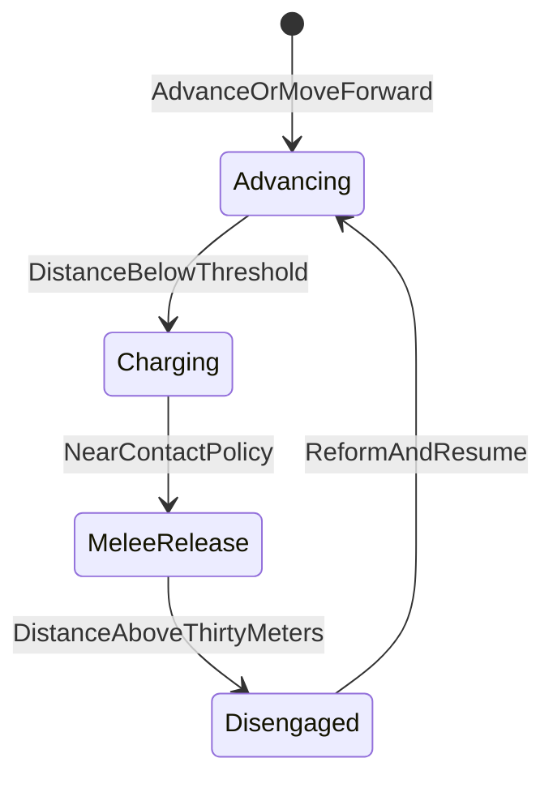

# Native cavalry command sequence (research only)

**Scope:** Research only. Describes how **vanilla-exposed APIs** could implement the doctrine sequence:

1. **Formation forward** (advance / move in formation)  
2. **Native charge when close**  
3. **Release position lock near contact**  
4. **Reform after ~30 m disengagement**

All mappings are **pattern-level** from local `TaleWorlds.MountAndBlade.dll` reflection on **v1.3.15** Native tag. **No gameplay code** was added; **no mod DLLs were decompiled**.

**Related:** [`base-game-order-scan.md`](base-game-order-scan.md), [`base-game-formation-layout-scan.md`](base-game-formation-layout-scan.md), [`implementation-decision-slice0.md`](implementation-decision-slice0.md).

---

## 1. Primitives observed (orders)

From `OrderType` enum names on this install (non-exhaustive list; see also order scan):

| Intent | Native `OrderType` candidates |
| --- | --- |
| Forward / advance in place | `Advance`, `AdvanceTenPaces` |
| Move to world point | `Move`, `MoveToLineSegment`, `MoveToLineSegmentWithHorizontalLayout` |
| Charge | `Charge`, `ChargeWithTarget` |
| Hold / brace | `StandYourGround` |
| Fall back / create separation | `FallBack`, `FallBackTenPaces`, `Retreat` |
| Mount control | `Mount`, `Dismount`, `RideFree` |

**MovementOrder** factories observed (static): `MovementOrderMove`, `MovementOrderChargeToTarget`, `MovementOrderFollow`, `MovementOrderFollowEntity`, `MovementOrderAttackEntity`.

**UNCERTAIN:** whether `Advance` vs `Move` better preserves “formation forward” for mounted units — **requires combat playtest** on target build.

---

## 2. Step-by-step mapping

### Step A — Formation forward

| Option | API sketch | Pros | Cons |
| --- | --- | --- | --- |
| **A1 (controller)** | `OrderController.SetOrder(OrderType.Advance)` (after selection) | Mirrors UI semantics | Player selection must be correct |
| **A2 (controller + point)** | `SetOrderWithPosition(OrderType.Move, worldPos)` | Strong positional control | May look less like “advance” than `Advance` |
| **A3 (direct)** | `Formation.SetMovementOrder(MovementOrder.MovementOrderMove(worldPos))` | No selection churn | UI may not reflect state |

**Research stance:** prefer **A1** if “advance” is literally what vanilla uses for *formation forward*; else **A2** for deterministic ground anchors.

---

### Step B — Native charge when close

| Option | API sketch | When |
| --- | --- | --- |
| **B1** | `OrderController.SetOrder(OrderType.Charge)` | Generic charge |
| **B2** | `OrderController.SetOrder(OrderType.ChargeWithTarget)` | If UI uses targeted charge on this build |
| **B3** | `Formation.SetMovementOrder(MovementOrder.MovementOrderChargeToTarget(enemyFormation))` | Needs **enemy `Formation`** reference |

**Proximity gating (mod-side):** `Formation` exposes **`CachedClosestEnemyFormationDistanceSquared`** (public getter observed) — plausible **distance proxy** for “when close”.

**UNCERTAIN:**

- Whether **squared cache** updates every tick or is throttled.  
- Whether it is **null-safe / zero** when no enemy — validate before sqrt.  
- Whether cavalry should use **LOS / terrain** checks (not in this DLL-only note).

---

### Step C — Release position lock near contact

`Formation` exposes **`OrderPositionLock`** (public getter/setter in reflection) but the reported **`PropertyType` was `System.Object`** on this pass — **BLOCKER** for writing mod code against a typed contract until ILSpy confirms the real type and legal values.

**Hypothesis (UNCERTAIN):** clearing or toggling this lock may correspond to “release formation anchor so melee can spread” — **must be validated** in-game; wrong writes could desync AI.

**Safer interim (UNCERTAIN):** issuing a new **`MovementOrder`** or `OrderType.RideFree` / spacing-related `ArrangementOrder` might achieve similar outcomes — **all require playtest**.

---

### Step D — Reform after ~30 m disengagement

**Detection:** compare **engagement distance** again (`CachedClosestEnemyFormationDistanceSquared` vs constant), or maintain a **mod-local timer** since last under-threshold — **UNCERTAIN** which matches vanilla “disengagement” feel.

**Reform orders:**

- `StandYourGround` to halt.  
- `ArrangementCloseOrder` / `ArrangementLine` / other `OrderType.Arrangement*` values observed on enum — pick the same family the UI uses.  
- `Formation.SetArrangementOrder(...)` + `SetFacingOrder(...)` per [`base-game-formation-layout-scan.md`](base-game-formation-layout-scan.md).

**UNCERTAIN:** whether vanilla exposes a single **“reform”** `OrderType` or it is always a **composition** of arrangement + facing + move.

---

## 3. Suggested state machine (documentation only)

Each transition should log: `OrderType`, selection snapshot, `OrderPositionIsValid`, `CachedClosestEnemyFormationDistanceSquared`, and (once known) **`OrderPositionLock`** state.

---

## 4. BLOCKER / UNCERTAIN summary

| Item | Status |
| --- | --- |
| Typed **`OrderPositionLock`** contract | **BLOCKER** until ILSpy / runtime typeof |
| **30 m** as engine-native concept | **UNCERTAIN** — likely **mod-local** distance threshold |
| **Advance vs Move** for mounted “formation forward” | **UNCERTAIN** — playtest |
| **`ChargeWithTarget`** availability & AI response | **UNCERTAIN** — mission-type dependent |

---

## 5. Follow-ups

1. ILSpy `OrderPositionLock` + any `MissionOrderUIHandler` interaction.  
2. Record a short combat clip + log lines for distance cache vs ground truth distance to enemy center.  
3. Confirm whether **`RideFree`** is appropriate for “release spacing” vs charge end — **doctrine decision**, not DLL-proven here.
